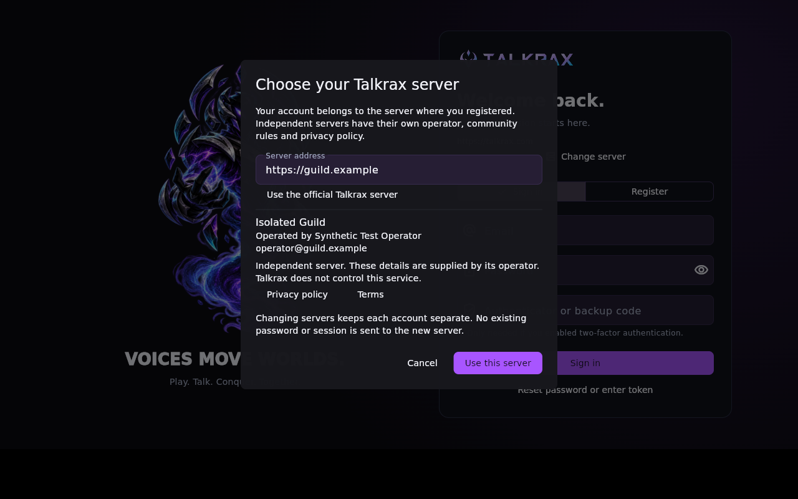

# Install a Talkrax client

## Linux x86-64

Get build 36 from [official downloads](https://talkrax.com/downloads).
Choose the Linux Installer (.deb) on Debian/Ubuntu, open it in your package
manager and install it. A portable archive is also available.

After launch, choose **Change server** on sign-in, enter your instance's HTTPS
origin, review the operator and policy links, and choose **Use this server**. Register
on that instance and verify your email. Accounts, login sessions and operators
are separate between instances. An official Talkrax account is not required.

The screenshot uses a synthetic test server. Use your own server address. The
installed build-36 client passed server selection, MFA sign-in and session
recovery after restart while access to the hosted service was blocked.
[Acceptance evidence](evidence/independent-linux-client36.json).

For administrators, enable authenticator MFA, then use the server's
appoint-owner command described in [server installation](SELF_HOSTING.md).

The installed application uses your OS audio/video devices. Screen capture
requires the desktop's capture support and any applicable user consent. The
release has synthetic X11 audio/capture evidence; physical camera/microphone,
Wayland and public-network call acceptance are not claimed.

## Windows

The currently published Windows build predates the accepted Linux server
selection work. A new Windows installer is still blocked by the unavailable
builder/CI access and has not been published. Do not use the old build as evidence
that independent Windows operation has passed.

## Web and Android

The official service supports these surfaces, but they are outside the current
independent server/client distribution scope.
